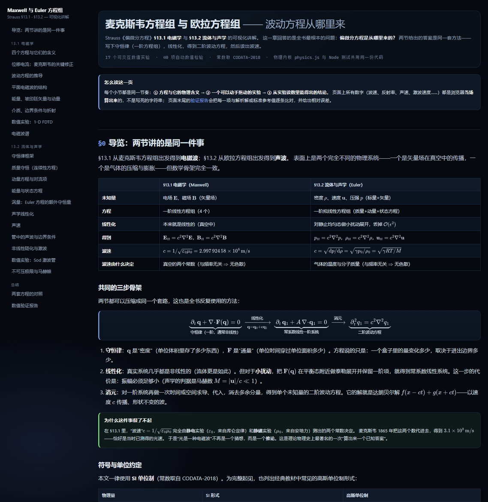
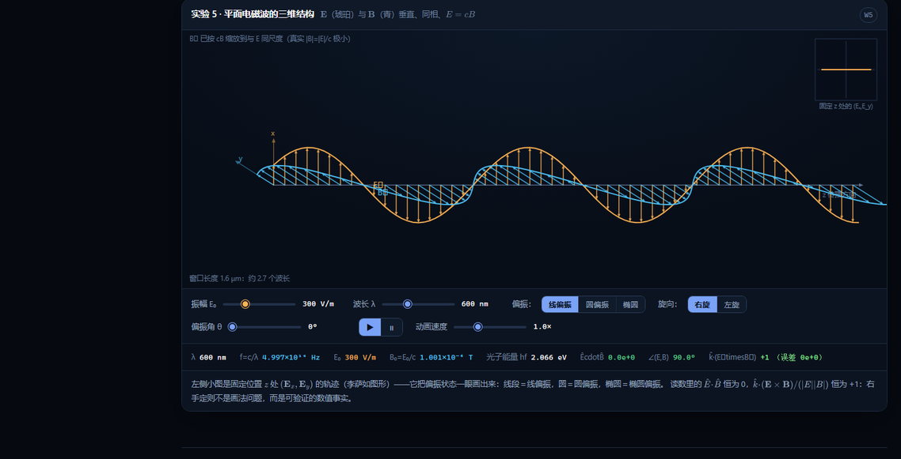
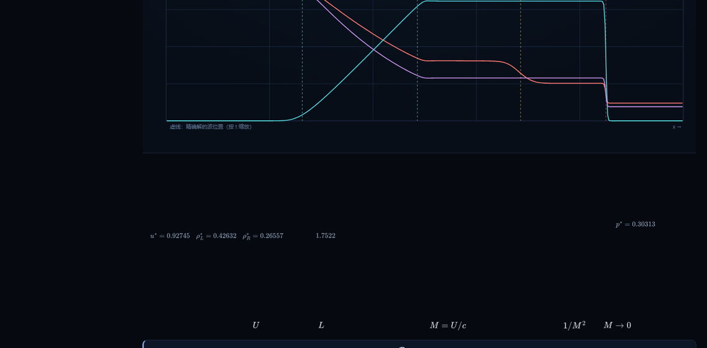

# Maxwell 方程组 与 Euler 方程组 · 可视化讲解

> PDE 仓库目录约定：本文件所在的 `source/` 保留可编辑源码、数值内核、图像和检查脚本；原单文件版 `standalone.html` 现为专题入口 [`../index.html`](../index.html)。在此目录执行 `node build.mjs` 会重建 `index.html` 与 `../index.html`。下面沿用原项目的文件说明；其中的 `standalone.html` 均指专题入口。

对应 **Strauss《Partial Differential Equations: An Introduction》§13.1 电磁学** 与 **§13.2 流体与声学**。
一页式交互讲解：方程 → 物理含义 → 可动手的实验 → 数值结论；页面上每个数字都是浏览器当场算出来的。

## 打开方式

| 文件 | 说明 |
|---|---|
| **index.html** | 主文件。与 mathjax/ 文件夹一起使用（完全离线）；若 mathjax/ 缺失会自动回落到 CDN |
| **standalone.html** | 单文件版（MathJax 已内联，约 2.3 MB），便于拷贝发送，不需要其他任何文件 |
| physics.js | 全部数值内核（无 DOM 依赖）；页面与 Node 测试**共用同一份代码** |
| tests/ | 自动检验：check.js（数值）、page_check.js（无头浏览器渲染）、report.json |
| src/ | 页面源码（HTML 分段 + CSS + JS），由 build.mjs 组装 |

直接双击 index.html 即可，无需服务器、无需联网。

## 预览

## 内容结构

### §13.1 麦克斯韦方程组

1. 四个方程 (M1)–(M4)：积分形式 ↔ 微分形式，逐项物理含义
2. 位移电流：删掉它方程组就与电荷守恒矛盾（自洽性反证）
3. 波动方程推导：七步代数；c = 1/sqrt(eps0 mu0) 由 CODATA 常数实时计算
4. 平面波结构：横波性、E ⊥ B ⊥ k、|B| = |E|/c、偏振（线/圆/椭圆）
5. 能量与动量：能量密度 u、坡印廷矢量 S、du/dt + div S = 0、辐射压
6. 介质与边界条件、斯涅尔定律、菲涅耳公式（含斜入射 Rs/Rp、布儒斯特角、全反射）
7. 数值实验：一维 FDTD（Yee 格式）脉冲入射介质板，数值 R、T 与菲涅耳公式比对
8. 电磁波谱：对数频率轴上跨越 19 个数量级

### §13.2 欧拉方程组

1. 守恒律框架：dq/dt + div F(q) = 0
2. 质量守恒（连续性方程）：平流项与压缩项的分解
3. 动量方程与对流项：定常流动中的加速度 a = (u·grad)u
4. 能量方程、状态方程、正压流；欧拉 vs 纳维–斯托克斯对照表
5. 涡量与开尔文环量定理；二维点涡的精确解（含哈密顿量守恒）
6. 声学线性化：小扰动展开 → p_tt = c² ∇²p；与传输线/光学的同构
7. 声速：c = sqrt(gamma R T / M)，绝热 vs 等温（牛顿差的那 15%）
8. 管中驻波与边界条件（Dirichlet/Neumann → 谐音列）
9. 非线性陡化：黎曼不变量、破波时间 tb = 2/[(gamma+1) A k]、等面积法则、Rankine–Hugoniot
10. 数值实验：Sod 激波管（HLL 有限体积），与 Toro 参考值逐项比较
11. 不可压极限（椭圆型方程从双曲系统涌现）与马赫锥

## 数值验证

页面末尾有一张**现场运行**的验证表；同一套检验也能在命令行跑（需要 Node）：

    node tests/check.js        # 47 项数值检验 -> tests/report.json，任何一项失败则非零退出
    node build.mjs             # 组装 + 校验（公式定界符、挂件实现、页内链接）
    node tests/page_check.js   # 无头浏览器：MathJax 是否报错、17 个挂件是否真的画出内容、页面 JS 异常
    node tests/standalone_check.js   # 单文件版的结构校验（脚本闭合、内核与挂件齐全）

自检覆盖的内容包括：

* Gauss 通量积分（球面 / 立方体面 / 两种半径）与 Q/eps0 的数值一致性
* div B = 0：偶极子场通过任意闭合曲面的通量（归一化后 < 1e-16）
* 菲涅耳公式：Rs+Ts=1、Rp+Tp=1（0–88°）、正入射极限、布儒斯特角 Rp=0、全反射
* 平面波：uE = uB 逐点相等、|S| = c u
* FDTD：脉冲速度 vs c（数值色散 < 0.1%）、|r| 与 |t| vs 菲涅耳、**二阶收敛**（误差比 3.9 ≈ 4）、S>1 必发散（CFL 条件）
* Sod 激波管：p*、u*、rho*_L、rho*_R、激波速度 vs Toro 表 4.1；质量/能量守恒到 1e-15；网格收敛
* 点涡：哈密顿量漂移（RK4）、涡对平移速度 vs Gamma/(2 pi d)
* 简单波破波时间：解析式 vs 相邻特征线首次相交的数值扫描

> 已知并**刻意保留**的局限：FDTD 有数值色散；HLL 看不见接触间断；声学线性化忽略 O(M²)；
> 陡化实验用的是单向简单波精确解（双向相互作用需数值求解）。

## 约定与来源

* 单位制：**SI**（常数取 CODATA-2018）；页内同时给出高斯单位制的对照表
* Sod 参考值：E. F. Toro, Riemann Solvers and Numerical Methods for Fluid Dynamics
* 方程编号 (M1)–(M4)、(13.6)–(13.11) 为本篇自编，便于引用；教材编号请以原书为准
